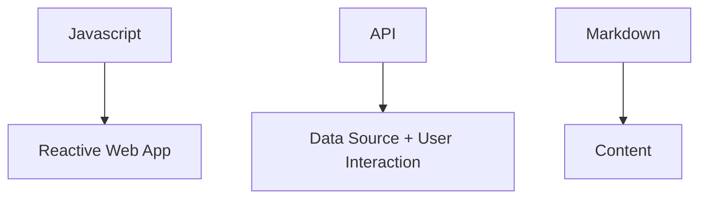

## JAMStack

**JAMStack** -> Javascript + API + Markdown

Javascript on the browser side - vanilla / React / Angular / Vue / Other .

API - backend no server don´t send html, instead exchanges data in JSON format.

Markdown - Text format that allows us to create richtext with very simple commands wich can than be parsed and converted in html.

Usamos Javascript para criar Reactive App Aplications, geralmente uma SPA, com um framework ou com vanilla javascript.

o API funciona como Data Source +User Interaction, por exemplo se o site tiver um botão de sign up, ele precisa de um backend que lide com esse click e adicione o usuário e seus dados a uma base de dados.

O Markdown adiciona o conteúdo ao site, tudo o que seja conteudo estático (texto/imagens) é criado em Markdown que depois é consumido e convertido em HTML que é renderizado pelo Browser.

Para tornarmos este processo mais prático existem os **Static Site Generatiors** que são ferrramentas que através de um input (em markdown por ex.) geram páginas html.

Lista de Static Site Generators - [https://www.staticgen.com/](https://www.staticgen.com/)

Ex: Gatsby, Hugo, Next

---

**tags:** #jamstack #javascript #gatsby #react #api #markdown 

**links:**

- https://jamstack.org/generators/
- https://www.youtube.com/watch?v=Y8PXMbr0Kqo